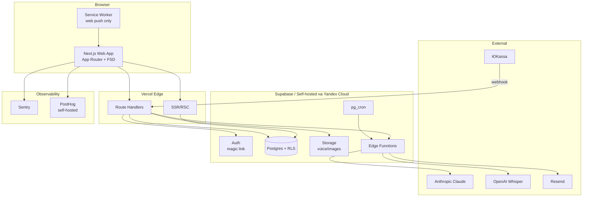

# Духовный Дневник Кассиопеи — Продуктовая Спецификация

**Версия:** 0.1 (draft)
**Формат:** веб-сайт (responsive, mobile-first), без нативных приложений на этом этапе
**Дата:** 2026-05

---

## 1. Видение продукта

### 1.1 Что это
Веб-сервис, в котором ученицы школы Кассиопея ведут «духовный дневник эмоций» — фиксируют переживания через интерактивное колесо вибраций, локализуют их в теле, проходят дыхательную практику и получают еженедельный ИИ-анализ паттернов. Сервис оформлен как продолжение мистического языка школы, а не как очередной mood-tracker.

### 1.2 Для кого
Ядро школы — женщины 35–55, практикующие контактерство и работу с вибрациями. Они уже привыкли к идее «дневника эмоций» как ритуальной практики (об этом говорит главный Гуру), но сейчас ведут его в блокноте или Notion — фрагментарно и без аналитики.

### 1.3 Ключевая ценность
- **Ритуал, а не дашборд.** Каждое взаимодействие ощущается как практика, а не как «заполнение формы».
- **Зеркало паттернов.** ИИ еженедельно показывает то, что человек сам в себе не видит — повторяющиеся триггеры, телесные зоны, связь с лунным циклом.
- **Эволюция, а не статистика.** Прогресс выражается в визуальной эволюции «светового тела», а не в графиках с цифрами.

### 1.4 Дифференциация от конкурентов
| Продукт | Чем отличается духовный дневник |
|---|---|
| Daylio, Moodnotes | язык и эстетика школы; ритуальная подача; вибрационная шкала вместо «1–5 звёзд» |
| Co-Star | действие, а не только наблюдение (дыхание, телесные практики, рефлексия) |
| Finch | duchovный, а не детский tone of voice; эволюция светового тела вместо питомца |
| How We Feel | язык школы Кассиопеи; ИИ-анализ; эзотерический контекст (Луна, чакры) |
| Insight Timer | фокус на дневнике, а не медитации; персональная история юзера |

### 1.5 Бизнес-модель
- **Free** — запись эмоций, базовое колесо, календарь за 30 дней, стрики
- **Light (490₽/мес)** — полная история, ИИ-анализ еженедельно, эмоция дня, голосовой ввод
- **Full (1490₽/мес)** — то же + ежемесячный глубокий разбор, ранний доступ к новым практикам, лунно-астрологический контекст
- **Годовая подписка** со скидкой 30%
- **Founder Lifetime** для первых 100 платящих

Минимальный донат от 300₽ (как в исходном брифе) можно оставить, но в роли «поддержать проект», не как основной тариф — иначе экономика не сходится из-за стоимости ИИ.

---

## 2. Аудитория

### 2.1 Сегменты

**Ядро (≈60%): «Опытная практикующая»**
- Женщина, 38–52, работает (часто self-employed: коуч, психолог, мастер ногтевого сервиса, риелтор)
- В школе 6+ месяцев, посещает регулярные онлайн-встречи, общается с инопланетянами/духами в личной практике
- Активно тратит деньги на курсы и сессии (5–30 тыс. ₽/мес на «развитие»)
- Доверяет авторитету Гуру, ориентируется на её рекомендации
- Технически: пользуется ноутбуком и телефоном примерно поровну, Telegram — основной мессенджер

**Перспективная (≈25%): «Новичок в школе»**
- 28–40 лет, пришла в школу 1–6 месяцев назад
- Ищет «свою» практику, пробует всё подряд, тревожна по поводу собственного прогресса
- Бюджет меньше, ценит структуру и «инструкции»
- Технически: преимущественно мобайл

**Периферия (≈15%): «Зрелая искательница»**
- 55–65 лет, времени и денег больше, чем у остальных
- Менее уверена в технологиях — критично UX
- Любит длинные тексты, серьёзный тон, ссылки на источники

### 2.2 Поведенческие триггеры

**Что заставит начать**: 
- Рекомендация Гуру в эфире (главный канал привлечения)
- FOMO: «другие ученицы уже ведут»
- Социальное подтверждение в чате школы

**Что заставит платить**:
- ИИ-анализ через 7 дней пробного периода — «зеркало», которое они не видели в себе сами
- Ограничение истории на free-плане (через месяц видны только последние 7 дней — критично, эмоциональный архив становится ценным)
- Лунно-астрологический контекст (этот сегмент платит за это везде)

**Что заставит остаться**:
- Эволюция светового тела — невозможно «начать сначала», обидно потерять
- Еженедельные отчёты, на которые ждут как на письмо
- Сезонные разблокировки практик (см. ниже)
- Стрики

### 2.3 Антипаттерны (что НЕ делать)
- Резкий научный тон. Слова «cortisol», «нейробиология эмоций» — мгновенный отток.
- Геймификация в стиле Duolingo (соревнования, очки). Только мистическая визуальная эволюция.
- Любые claim'ы про лечение, диагностику. Только мягкие формулировки.
- Реклама, баннеры, partner-предложения. Эта аудитория считывает «коммерциализацию» как «низкие вибрации».

---

## 3. Функционал

### 3.1 Онбординг (5–7 минут, обязательный)

Цель: установить идентичность пользовательницы внутри продукта и собрать данные для персонализации.

Шаги:
1. **Приветственный экран** с описанием миссии (1 экран, ~80 слов)
2. **Согласие на обработку ПДн** (юридически обязательно)
3. **Базовая информация**: имя, дата рождения, опционально — время и место рождения (для астрологии)
4. **Замер базовой вибрации** — 10 вопросов с вариантами ответов, результат на шкале Хокинса (0–1000)
5. **Выбор проводника-тотема** — 4 варианта (Волк / Олень / Феникс / Дельфин), каждый со своим tone of voice в ИИ-ответах
6. **Намерение на 30 дней** — свободный текст или выбор из 6 преднастроенных
7. **Первая мини-практика «настройка канала»** — 90-секундное дыхание с визуализацией

После онбординга пользовательница попадает на главный экран с уже сделанной первой записью.

### 3.2 Главный экран

Состав:
- Сегодняшняя дата + лунная фаза (Full только)
- Карта дня (одно послание, см. 3.7)
- Большая кнопка «Записать эмоцию» (основное действие)
- Виджет «Эмоция дня» (см. 3.6)
- Световое тело в углу (текущее состояние)
- Стрик / счётчик дней
- Снизу: календарь, прогресс, профиль

### 3.3 Цикл записи эмоции (главный flow)

Длительность: 30 секунд (быстрый режим) — 3 минуты (полный с дыханием).

**Шаг 1. Колесо эмоций**
- Круг разделён на 4 концентрических сектора по уровню вибрации (на основе шкалы Хокинса):
  - Внутренний круг: трансцендентные (Просветление, Покой, Радость, Любовь — 500+)
  - Второй: высокие (Принятие, Разум, Готовность — 350–500)
  - Третий: средние (Нейтралитет, Смелость, Желание — 200–350)
  - Внешний: низкие (Гнев, Страх, Печаль, Апатия, Вина, Стыд — 0–200)
- 24–32 эмоции на колесе, цветовая палитра — переход от тёмно-фиолетового к золотому
- Тап по эмоции → выделение → вибрация на устройстве (Vibration API на мобайле) → переход дальше
- При hover/долгом тапе — короткое описание эмоции и её функции

**Шаг 2. Интенсивность**
- Слайдер 1–10 или 5 точек
- Минималистично, без подписей цифр

**Шаг 3. Причина**
- 8 базовых категорий-чипов: Семья, Работа, Любовь, Деньги, Здоровье, Друзья, Духовное, Другое
- После выбора категории — 4–6 подтегов (например, Семья → Дети / Родители / Партнёр / Развод / Конфликт)
- **Решение проблемы повторяющегося ввода**: после категории показывается «Как в прошлый раз?» с тремя последними ситуациями — один тап вставляет ту же ситуацию

**Шаг 4. Мысль**
- Поле «Что говорит ум?» — 1 предложение, опционально
- Кнопка «Пропустить» крупная, на одном уровне с «Далее»

**Шаг 5. Локализация в теле**
- SVG-силуэт человека, 12 кликабельных зон + 7 чакральных
- Тап → отметка
- Если эмоция была из верхних секторов колеса → появляется светлячок (анимированная частица, золотое свечение)
- Если из нижних → чёрный «ёжик» (тёмная пульсирующая точка с шипами)

**Шаг 6. Дыхательная практика**
- Опциональна, но предлагается по умолчанию
- Дыхание по схеме 5-5 (вдох 5 сек / выдох 5 сек) — мягкий ритм, не слишком интенсивно
- Визуально: расширяющийся и сжимающийся круг + ваш светлячок/ёжик в центре
- 6 циклов = 1 минута, можно остановить раньше
- Опционально — звук частоты сольфеджио (396/432/528 Гц) на фоне
- На каждом вдохе светлячок ярче, ёжик постепенно превращается в светлячок (морфинг через 6 циклов)

**Шаг 7. Завершение**
- «Состояние сохранено в твоё световое тело»
- Световое тело анимируется (одна новая точка света)
- Опционально — короткая фраза от тотема

### 3.4 Решение проблемы «надоело описывать ситуацию»

Главный риск отвала. Решения, расположенные слоями:

1. **Чипы по умолчанию.** В быстром режиме описание не требуется вовсе — достаточно эмоции + причины (тег) + тела. Это покрывает 80% записей.
2. **«Как в прошлый раз».** Один тап вставляет описание из недавней похожей записи.
3. **Голосовой ввод** (V1.1, не MVP). Кнопка микрофона на поле описания → запись до 60 сек → Whisper транскрипция в фоне.
4. **Умные подсказки от ИИ.** В конце недели ИИ помечает 2–3 записи: «Хочешь раскрыть это подробнее?» — пользовательница пишет развёрнутый текст не каждый день, а 2–3 раза в неделю, и ровно про значимое.
5. **Двухскоростной режим.** В настройках — «Быстрая запись» / «Глубокая запись». Быстрая = пропуск шагов 4 и опционально 6.

### 3.5 Календарь и история

- Месячная сетка, дни кликабельны
- На каждый день: точка-индикатор (цвет = средняя вибрация дня)
- Множественные записи в день — точка превращается в маленький кружок с фрагментами цветов
- Тап на день → список записей дня → тап на запись → детали
- Возможность редактировать запись в течение 24 часов
- Поиск по тексту мысли/ситуации (Full)
- Фильтры: по эмоции, по причине, по чакре

### 3.6 Эмоция дня

- Один раз в сутки система предлагает «эмоцию дня» — например, «Сегодня — Благодарность»
- Описание (~100 слов): функция эмоции, для чего она нужна, что блокирует
- Предложение: «В течение дня замечай моменты, когда возникает благодарность. Запиши вечером, что наблюдала.»
- Вечером — короткая форма «Что заметила?» (текст или голос)
- Все ответы попадают в ИИ-анализ
- Контент пишется кураторами школы заранее (66 эмоций × текст ≈ 2 месяца ротации до повтора)

### 3.7 Карта дня

- Утром (или при первом заходе) — одна архетипическая карта с посланием
- Карта = название + изображение + текст 60–120 слов + символизм
- Колода: 78 карт (по аналогии с Таро, но не Таро — авторская колода в эстетике школы)
- Карта генерится псевдо-рандомом с seed по date+user_id, повторение карт у одного пользователя не чаще 1 раза в 30 дней
- Можно «вытянуть ещё одну» 1 раз в день (Light+)
- Возможность сохранить карту в избранное

### 3.8 Еженедельный ИИ-анализ (главный платный crown)

Запускается каждое воскресенье в 18:00 по часовому поясу пользовательницы (если набралось ≥4 записей за неделю — иначе откладывается).

Анализ включает:
- **Паттерны эмоций**: топ-3 эмоции недели + их триггеры
- **Карта тела**: где эмоции «жили» чаще всего
- **Связи**: «гнев на этой неделе чаще возникал во вторник и четверг, после рабочих звонков»
- **Лунный контекст** (Full): «всплеск тревоги пришёлся на квадрат Луна–Сатурн»
- **Прогресс**: куда сместилось среднее значение вибрации
- **Послание тотема**: в голосе выбранного проводника, 2–3 абзаца
- **Практика на следующую неделю**: одна конкретная рекомендация

Формат: красивая страница с разделами, можно скачать PDF.

**Технически**:
- Запускается через pg_cron → Edge Function
- Промпт собирается из всех записей за 7 дней + контекста (тотем, базовая вибрация, история анализов)
- Модель: Claude Sonnet 4 (или OpenAI равнозначно)
- Latency не критичен — генерация в фоне, юзер получает email/push «Анализ готов»
- Стоимость: ~$0.05–$0.15 за анализ → нужно закладывать в unit economics

### 3.9 Прогресс

Не графики цифр (это отпугивает аудиторию), а:
- **Карта тела за месяц**: силуэт с цветовой картой того, где «жили» эмоции
- **Карта чакр**: 7 чакр, насколько каждая «активна» (=количество локализаций)
- **Вибрационная спираль**: спираль из точек, каждая точка = день, цвет = средняя вибрация
- **Световое тело**: визуальная эволюция (см. ниже)
- График вибрации по неделям (Full) — для тех, кто всё-таки любит цифры

### 3.10 Световое тело

Главный retention-механизм. Аналог Finch'овского питомца, но в эстетике школы.

- При создании аккаунта — тёмный силуэт с одной светящейся точкой (сердце)
- Каждая запись добавляет точку света на соответствующее место в теле
- Точки накапливаются → формируют сияющие узоры
- Уровни (1, 2, 3, ...): при наборе N точек уровень повышается, силуэт становится светлее, открываются «слои» (золотой ободок, ауральные кольца, и т.д.)
- Каждое дыхательное упражнение — +1 яркость
- Если перерыв 7+ дней — точки тускнеют (но не исчезают), есть «обряд возвращения» (мини-практика на 2 минуты)
- В личном кабинете светового тела можно его рассматривать, поворачивать (3D опционально в V2)

### 3.11 Лунно-астрологический контекст (Full)

- Бесплатные данные через Swiss Ephemeris (npm: `swisseph-wasm` или `astronomia`)
- На главном экране — текущая фаза Луны и её знак
- В еженедельном анализе — ключевые транзиты недели и корреляции
- Опциональная функция «Намерение на новолуние / отпускание на полнолуние» — раз в 2 недели приходит особая запись с расширенной практикой

### 3.12 Сезонные разблокировки практик

Цель: решить «голод к новизне» аудитории.

- Старт: доступна базовая запись эмоций
- День 14: открывается «Диалог с эмоцией» (расширенный flow с письменной рефлексией)
- День 30: открывается «Работа с тенью» (специальная практика для эмоций ниже 200)
- День 60: «Внутренний ребёнок»
- День 90: «Будущая я»
- День 180: «Кармические паттерны» (с пересечением астрологии)
- Раз в квартал — сезонный ритуал (равноденствия/солнцестояния)

Логика разблокировки не за деньги, а за длительность практики. Это и retention, и ощущение пути инициации.

### 3.13 Голосовой ввод (V1.1)

- Кнопка микрофона в полях «мысль» и «ситуация»
- Запись через MediaRecorder API, длина до 60 сек
- Отправка на сервер → транскрипция через Whisper API → результат в текстовое поле
- Оригинальная аудиозапись сохраняется (опция в настройках) — для будущей «карты тембра»

### 3.14 Подписка и оплата

- Тарифы Free / Light (490₽/мес) / Full (1490₽/мес)
- Годовая подписка со скидкой 30%
- Оплата через **ЮKassa** (основной провайдер для РФ, поддержка рекуррентных платежей)
- Альтернатива/fallback: CloudPayments
- Промокоды (для рассылки от школы)
- Кошелёк «поддержать проект» — донат от 300₽ для тех, кто хочет дать больше базовой цены
- Грейс-период 3 дня после неудачного списания
- Возможность отмены подписки в один клик из настроек

### 3.15 Уведомления

- Каналы: email (обязательный) + Web Push (опционально)
- Telegram-бот как канал в V1.1 (эта аудитория живёт в Telegram)
- Триггеры:
  - Утром: карта дня + эмоция дня
  - Вечером в 21:00 (настраивается): мягкое напоминание «как прошёл день?»
  - Воскресенье 18:00: «Твой анализ готов»
  - Новолуние/полнолуние: ритуальное напоминание (Full)
  - Стрик-уведомления (5, 10, 30, 100 дней)
- Тон уведомлений — поэтический, не функциональный
- Полное управление каналами и временем в настройках

### 3.16 Безопасность контента (crisis safety)

Аудитория уязвима. Это не опция, это обязательное.

- Текстовый ввод (мысль, ситуация, голос после транскрипции) проверяется на маркеры кризисного состояния (упоминания самоповреждения, суицида, тяжёлой утраты)
- При срабатывании: ИИ-анализ заменяется на template с контактами психолога/телефонов доверия + предложение связаться с куратором школы
- Флаг в БД (`crisis_flags`) для куратора школы (не для автоматических действий — только для своевременной поддержки человеком)
- В обычных ИИ-ответах — никаких медицинских формулировок и диагнозов
- В Settings — постоянно доступная страница с контактами поддержки

---

## 4. Техническая реализация

### 4.1 Стек

**Frontend**
- Next.js 15 (App Router) + TypeScript strict
- Архитектура: Feature-Sliced Design (FSD)
- Tailwind CSS + design tokens (custom theme школы)
- Framer Motion (anim. колеса, дыхания, светлячков, светового тела)
- Zustand (client state)
- TanStack Query (server state, caching)
- React Hook Form + Zod (формы + валидация)
- Lucide React + кастомные SVG (колесо, тело, чакры)
- Tone.js (сольфеджио на фоне)

**Backend**
- Supabase (managed)
  - Postgres 16 + RLS
  - Auth (magic link + опционально OAuth с Google/Yandex)
  - Storage (для голосовых файлов)
  - Edge Functions (Deno runtime) для бизнес-логики, ИИ, webhook-ов
  - pg_cron для расписания (еженедельный анализ, ротация эмоции дня, лунные расчёты)
- Опционально pgvector — для семантического поиска по записям в V2

**ИИ**
- Anthropic Claude API (Sonnet 4) для еженедельного анализа и интерпретации карт
- OpenAI Whisper API для голосового ввода (V1.1)
- Claude Haiku для лёгких задач (генерация дневных карт пачками)

**Внешние сервисы**
- ЮKassa для платежей
- Resend или Yandex.Mail для transactional email
- Swiss Ephemeris (npm `astronomia` или `swisseph-wasm`) для астрологии — локально, без API
- Sentry для error tracking
- PostHog (self-hosted) для продуктовой аналитики — приватность критична

**Хостинг**
- Frontend: Vercel (Edge runtime где возможно)
- Backend: Supabase managed
- Cloudflare перед всем — DDoS, кэширование статики
- **⚠️ Важно**: для соответствия 152-ФЗ (хранение ПДн РФ-граждан на территории РФ) Supabase EU/US **не подходит**. Варианты:
  - Self-hosted Supabase на Yandex Cloud / Selectel
  - Прямой Postgres в Yandex Cloud + Auth0/собственная auth-логика
  - **Это решение нужно принять в самом начале**, иначе будет мигрировать всё с нуля

### 4.2 Архитектура



### 4.3 Модель данных (ключевые таблицы)

```sql
-- auth.users — управляется Supabase Auth

profiles (
  id uuid PK FK -> auth.users(id),
  display_name text NOT NULL,
  totem text CHECK (totem IN ('wolf','deer','phoenix','dolphin')),
  base_vibration int CHECK (base_vibration BETWEEN 0 AND 1000),
  intention_30d text,
  birth_date date,
  birth_time time,
  birth_location text,
  birth_lat numeric, birth_lng numeric,
  timezone text DEFAULT 'Europe/Moscow',
  onboarding_completed bool DEFAULT false,
  consent_pdn_accepted_at timestamptz NOT NULL,
  marketing_consent bool DEFAULT false,
  created_at timestamptz DEFAULT now(),
  updated_at timestamptz DEFAULT now()
)

emotions_catalog (
  id uuid PK,
  slug text UNIQUE,
  name_ru text NOT NULL,
  hawkins_level int,
  vibration_tier text CHECK (vibration_tier IN ('low','mid','high','transcendent')),
  color_hex text,
  function_description text,
  default_body_zones text[],
  is_active bool DEFAULT true
)

emotion_entries (
  id uuid PK,
  user_id uuid FK -> profiles(id) NOT NULL,
  emotion_id uuid FK -> emotions_catalog(id),
  intensity int CHECK (intensity BETWEEN 1 AND 10),
  cause_category text,  -- family/work/love/money/health/friends/spiritual/other
  cause_subtag text,
  thought text,
  situation text,
  situation_voice_url text,
  body_part text,  -- crown/third_eye/throat/heart/solar/sacral/root/head/etc
  chakra text,
  breathing_completed bool DEFAULT false,
  breathing_duration_sec int,
  mood_after int,
  entry_date date NOT NULL,  -- denormalized for calendar perf
  created_at timestamptz DEFAULT now(),
  edited_until timestamptz DEFAULT now() + interval '24 hours'
)
CREATE INDEX ON emotion_entries(user_id, entry_date DESC);
CREATE INDEX ON emotion_entries(user_id, emotion_id);

daily_emotions (
  id uuid PK,
  date date UNIQUE NOT NULL,
  emotion_id uuid FK -> emotions_catalog(id),
  function_text text,
  observation_prompt text,
  active bool DEFAULT true
)

daily_emotion_responses (
  id uuid PK,
  user_id uuid FK -> profiles(id),
  daily_emotion_id uuid FK,
  response_text text,
  voice_url text,
  created_at timestamptz DEFAULT now()
)

cards_catalog (
  id uuid PK,
  title text,
  image_url text,
  message text,
  symbolism text,
  active bool DEFAULT true
)

daily_card_draws (
  id uuid PK,
  user_id uuid FK,
  card_id uuid FK,
  date date,
  is_bonus_draw bool DEFAULT false,
  is_favorite bool DEFAULT false,
  created_at timestamptz DEFAULT now(),
  UNIQUE(user_id, date, is_bonus_draw)
)

weekly_analyses (
  id uuid PK,
  user_id uuid FK,
  period_start date,
  period_end date,
  patterns jsonb,
  totem_voice_response text,
  practice_recommendation text,
  metrics jsonb,
  status text CHECK (status IN ('pending','ready','failed','skipped_low_data')),
  generated_at timestamptz,
  cost_usd numeric,
  model_used text
)

astrology_context (
  date date PK,
  moon_phase text,
  moon_sign text,
  retrogrades jsonb,
  key_transits jsonb,
  cached_at timestamptz
)

subscriptions (
  id uuid PK,
  user_id uuid FK,
  tier text CHECK (tier IN ('free','light','full','founder_lifetime')),
  status text,  -- active/cancelled/grace/expired
  provider text,
  provider_subscription_id text,
  current_period_start timestamptz,
  current_period_end timestamptz,
  cancelled_at timestamptz,
  created_at timestamptz DEFAULT now()
)

payments (
  id uuid PK,
  user_id uuid FK,
  subscription_id uuid FK,
  amount_kopecks int,
  currency text DEFAULT 'RUB',
  provider text,
  provider_payment_id text,
  status text,
  raw_response jsonb,
  created_at timestamptz DEFAULT now()
)

unlocked_practices (
  user_id uuid,
  practice_key text,
  unlocked_at timestamptz DEFAULT now(),
  PRIMARY KEY (user_id, practice_key)
)

light_body_state (
  user_id uuid PK FK,
  level int DEFAULT 1,
  light_points int DEFAULT 1,
  brightness numeric DEFAULT 0.1,
  last_evolved_at timestamptz,
  visual_state jsonb  -- positions, colors, special layers
)

streaks (
  user_id uuid PK FK,
  current_streak int DEFAULT 0,
  longest_streak int DEFAULT 0,
  last_entry_date date
)

crisis_flags (
  id uuid PK,
  user_id uuid FK,
  entry_id uuid FK,
  triggered_by text,  -- which keywords/classifier
  reviewed_by_curator bool DEFAULT false,
  created_at timestamptz DEFAULT now()
)

audit_logs (
  id bigserial PK,
  actor_user_id uuid,
  action text,
  target_user_id uuid,
  target_entity text,
  meta jsonb,
  ip inet,
  created_at timestamptz DEFAULT now()
)
```

### 4.4 RLS-политики (примеры)

```sql
-- emotion_entries: пользователь видит только свои
ALTER TABLE emotion_entries ENABLE ROW LEVEL SECURITY;

CREATE POLICY "users read own entries"
  ON emotion_entries FOR SELECT
  USING (auth.uid() = user_id);

CREATE POLICY "users insert own entries"
  ON emotion_entries FOR INSERT
  WITH CHECK (auth.uid() = user_id);

CREATE POLICY "users update own entries within 24h"
  ON emotion_entries FOR UPDATE
  USING (auth.uid() = user_id AND now() < edited_until);

CREATE POLICY "no deletes by users" 
  ON emotion_entries FOR DELETE
  USING (false);  -- удаления только через soft-delete или admin action
```

Аналогичные политики на: `profiles`, `daily_emotion_responses`, `daily_card_draws`, `weekly_analyses`, `subscriptions`, `payments` (read-only для юзера), `light_body_state`, `streaks`.

Каталоги (`emotions_catalog`, `cards_catalog`, `daily_emotions`, `astrology_context`) — read для всех authenticated, write — только service role.

### 4.5 ИИ-слой

**Сборка контекста для еженедельного анализа** (псевдокод):

```ts
async function buildWeeklyContext(userId, periodStart, periodEnd) {
  const profile = await getProfile(userId);
  const entries = await getEntries(userId, periodStart, periodEnd);
  const dailyResponses = await getDailyResponses(userId, periodStart, periodEnd);
  const prevAnalysis = await getLastAnalysis(userId);
  const astroContext = await getAstroContext(periodStart, periodEnd);
  
  return {
    profile: {
      totem: profile.totem,
      base_vibration: profile.base_vibration,
      intention: profile.intention_30d,
    },
    week_data: {
      entries: entries.map(stripPII), // удаляем имена и т.д.
      observations: dailyResponses,
    },
    context: {
      astro: astroContext,
      previous_patterns: prevAnalysis?.patterns,
    }
  };
}
```

**Системный промпт** (структура):
1. Роль: «Ты — проводник в духовной практике, говоришь голосом тотема {totem}. Никогда не ставишь диагнозы. Не используешь медицинскую лексику. Никаких claim'ов о лечении.»
2. Стиль тотема (4 разных стиля)
3. Формат вывода: строгий JSON для UI + текстовое послание
4. Если детектирован кризисный контент: остановись и верни safe_response=true

**Output schema** (Zod на стороне приложения):
```ts
const AnalysisOutput = z.object({
  safe: z.boolean(),
  top_emotions: z.array(z.object({
    emotion_slug: z.string(),
    count: z.number(),
    main_triggers: z.array(z.string())
  })),
  body_map_summary: z.string(),
  patterns: z.array(z.string()),
  astro_correlation: z.string().nullable(),
  totem_message: z.string(),
  practice_recommendation: z.string()
});
```

**Кризисная детекция**:
- Двойной слой: keyword list (быстрый) + классификатор (LLM с маленькой моделью или Perspective API)
- При срабатывании любого слоя — `safe_response` template вместо обычного ответа
- Запись в `crisis_flags` для куратора

### 4.6 Платежи (ЮKassa)

Flow:
1. Юзер выбирает тариф → frontend создаёт «намерение» через API → API дёргает ЮKassa Create Payment с типом recurring
2. Юзер уходит на ЮKassa, платит первый раз
3. ЮKassa возвращает webhook → API валидирует подпись → создаёт subscription + payment record
4. ЮKassa дальше списывает автоматически → webhook на каждый успешный/неуспешный → API обновляет subscription
5. Cancellation: API дёргает ЮKassa cancel + помечает subscription как cancelled (с current_period_end в будущем)
6. Грейс 3 дня после failed payment перед даунгрейдом на free

Webhook security:
- HMAC валидация подписи
- Idempotency key через provider_payment_id (UNIQUE)
- Логирование raw_response для дебага

### 4.7 Расписание задач (pg_cron)

```sql
-- Еженедельный анализ для всех активных юзеров (запускается каждые 15 минут, обрабатывает по таймзонам)
SELECT cron.schedule(
  'weekly-analysis-trigger',
  '*/15 * * * *',
  $$ SELECT trigger_weekly_analyses() $$
);

-- Ротация "эмоции дня" 00:01 UTC
SELECT cron.schedule(
  'rotate-daily-emotion',
  '1 0 * * *',
  $$ SELECT rotate_daily_emotion() $$
);

-- Обновление астрологии раз в сутки 00:05 UTC
SELECT cron.schedule(
  'refresh-astrology',
  '5 0 * * *',
  $$ SELECT refresh_astrology_context() $$
);

-- Обновление streaks 03:00 UTC (после полуночи всех РФ-таймзон)
SELECT cron.schedule(
  'recalc-streaks',
  '0 3 * * *',
  $$ SELECT recalculate_streaks() $$
);
```

---

## 5. Безопасность и приватность

### 5.1 Юридический контекст

**152-ФЗ (РФ ПДн)**:
- Согласие на обработку ПДн получается явно на регистрации (галочка, без неё аккаунт не создаётся)
- Локализация хранилища ПДн на территории РФ — **серверы в РФ** (Yandex Cloud, Selectel)
- Уведомление в Роскомнадзор о статусе оператора ПДн
- Политика конфиденциальности и публичная оферта (юрист → подготовить)
- Право на удаление: полная процедура за 30 дней
- Право на доступ: экспорт всех данных в JSON + PDF в один клик

**Сертификация платежей**: ЮKassa берёт PCI-DSS на себя, мы не храним карточные данные.

### 5.2 Аутентификация

- **Magic link** через Supabase Auth (passwordless) — эта аудитория забывает пароли
- Опциональный OAuth (Yandex, VK ID) — V1.1
- Session: HTTP-only, Secure, SameSite=Lax cookies
- Refresh token rotation (Supabase делает по умолчанию)
- Login throttling: 5 попыток на email в час → 30 минут блок
- 2FA через TOTP — опционально в V2

### 5.3 Шифрование

- TLS 1.3 в транзите (Cloudflare → Vercel → Supabase)
- HSTS + preload
- Postgres at-rest encryption (Supabase by default)
- **Application-level encryption** для самых чувствительных полей (`thought`, `situation`, `situation_voice_url`): AES-256-GCM, ключ в Yandex KMS или HashiCorp Vault
- Голосовые файлы — encrypted в Storage, доступ через signed URL с TTL 5 минут

### 5.4 Защита от атак

- Rate limiting на API через Upstash Redis (Vercel-friendly) или Cloudflare WAF rules
- CSRF: SameSite cookies + double-submit token на mutating actions
- XSS: строгий CSP (`default-src 'self'`, `script-src 'self' 'nonce-...'`), DOMPurify для любого user-rendered текста
- SQL injection: исключительно prepared statements через Supabase SDK
- Headers: `Strict-Transport-Security`, `X-Content-Type-Options: nosniff`, `X-Frame-Options: DENY`, `Referrer-Policy: strict-origin-when-cross-origin`
- Защита webhook endpoints: только HMAC + список IP ЮKassa

### 5.5 ИИ-безопасность

- Промпты не логируются с PII (имя/локация удаляются перед отправкой)
- Anthropic API: запрос zero data retention (через корпоративный план)
- Whisper транскрипция: явное согласие пользователя на обработку голоса при первом использовании
- Никакие медицинские/диагностические утверждения в ответах ИИ (запрещено в system prompt, дополнительно — output filter)
- Кризисная детекция перед публикацией ИИ-ответа пользователю

### 5.6 Audit & Backups

- Daily snapshot Postgres (Supabase делает по умолчанию)
- Point-in-time recovery 7 дней
- Раз в неделю — off-site backup в холодное хранилище
- Audit log для всех админских действий (вход в админку, просмотр чужих данных, экспорт)
- Алерт в Slack/Telegram куратору при срабатывании crisis_flag

### 5.7 Privacy as marketing

Эта аудитория сверхчувствительна к приватности. Используем это:
- На лендинге: «Мы не продаём твои данные. Никогда. Никому.»
- Прозрачная политика без юр-жаргона (вторая версия рядом с официальной)
- Кнопка «Удалить всё» доступна без вопросов и из главных настроек
- Опция «приватный режим» — записи не используются в обучении ИИ (даже обезличенно)
- Ноль трекеров кроме Sentry (errors only) и PostHog (self-hosted)

---

## 6. Метрики и аналитика

### 6.1 Ключевые метрики

**Acquisition**
- Регистрации в день / источник
- CR из визита в регистрацию
- CR из регистрации в первую запись (=онбординг finished)

**Activation**
- D1, D7, D30 retention
- % юзеров, сделавших ≥3 записи в первую неделю
- % дошедших до первого weekly analysis

**Engagement**
- DAU/WAU/MAU
- Средняя длина стрика
- Записей на юзера в неделю
- % с включённой дыхательной практикой

**Monetization**
- CR free → light, light → full
- Средняя выручка на пользователя (ARPU)
- LTV / CAC
- Churn rate месячный / годовой
- Грейс-период recovery rate

**Quality**
- NPS (показывается раз в 30 дней)
- Доля weekly_analysis status=failed
- Среднее время генерации анализа
- Crisis flags в неделю (и % разрешённых куратором)

### 6.2 События

Минимальный набор для PostHog:
- `signup_started`, `signup_completed`
- `onboarding_step_completed` (с шагом)
- `entry_started`, `entry_emotion_selected`, `entry_completed` (с пройденными шагами)
- `breathing_started`, `breathing_completed`
- `weekly_analysis_viewed`
- `subscription_started`, `subscription_cancelled`, `subscription_renewed`
- `practice_unlocked`
- `card_drawn`, `card_favorited`
- Без PII в payload

---

## 7. Декомпозиция на задачи

Оценки — для одного fullstack разработчика, человеко-дни. P0 — критично для MVP, P1 — желательно в MVP, P2 — после MVP.

### EPIC 0: Foundation

| ID | Задача | Прио | Оценка | Зависит от |
|---|---|---|---|---|
| F-01 | Решение по локализации хранилища (Yandex Cloud vs Supabase EU + риск) — обсудить с юристом | P0 | 1 | — |
| F-02 | Инициализация Next.js 15 + TS + Tailwind + FSD-структура | P0 | 1 | F-01 |
| F-03 | Подключение Supabase (или self-hosted), env-конфигурация | P0 | 1 | F-01 |
| F-04 | CI/CD: GitHub Actions → Vercel + миграции Supabase | P0 | 1 | F-02 |
| F-05 | Sentry, PostHog (self-hosted) интеграция | P0 | 1 | F-04 |
| F-06 | Design tokens, базовая темизация в эстетике школы | P0 | 2 | F-02 |
| F-07 | UI Kit: Button, Input, Modal, Toast, Sheet, Skeleton (базовые компоненты) | P0 | 3 | F-06 |
| F-08 | Layout: AppShell, навигация (нижняя на мобиле + сайдбар на десктопе) | P0 | 2 | F-07 |
| F-09 | i18n заготовка (русский на старте, расширяемо) | P1 | 1 | F-02 |
| F-10 | Security headers, CSP, HSTS | P0 | 1 | F-04 |
| F-11 | Privacy/Terms страницы (статика + версионирование) | P0 | 1 | F-08 |

**Итого EPIC 0: ~15 дней**

### EPIC 1: Auth & Profile

| ID | Задача | Прио | Оценка |
|---|---|---|---|
| A-01 | Magic link auth flow (Supabase Auth) + callback page | P0 | 2 |
| A-02 | Login throttling | P0 | 1 |
| A-03 | Согласие на ПДн на регистрации + сохранение timestamp | P0 | 1 |
| A-04 | Profile-таблица, миграции, типы | P0 | 1 |
| A-05 | RLS-политики на profiles | P0 | 1 |
| A-06 | Страница профиля (просмотр / редактирование) | P1 | 2 |
| A-07 | Settings: тарифы, уведомления, приватный режим, удаление аккаунта | P0 | 3 |
| A-08 | Удаление аккаунта flow (soft → hard через 30 дней) | P0 | 2 |
| A-09 | Экспорт данных в JSON + PDF | P1 | 2 |
| A-10 | OAuth (Yandex/VK) | P2 | 2 |

**Итого EPIC 1: ~15 дней**

### EPIC 2: Онбординг

| ID | Задача | Прио | Оценка |
|---|---|---|---|
| O-01 | Шаг 1: приветствие + миссия | P0 | 1 |
| O-02 | Шаг 2: согласие ПДн | P0 | 1 |
| O-03 | Шаг 3: имя, дата/время/место рождения (с автодополнением локаций) | P0 | 2 |
| O-04 | Шаг 4: тест на базовую вибрацию (10 вопросов + расчёт) | P0 | 3 |
| O-05 | Шаг 5: выбор тотема (4 варианта + описания) | P0 | 2 |
| O-06 | Шаг 6: намерение на 30 дней | P0 | 1 |
| O-07 | Шаг 7: первая мини-практика дыхания | P0 | 2 |
| O-08 | Сохранение прогресса онбординга (можно прервать и продолжить) | P0 | 2 |
| O-09 | Аналитика onboarding-шагов | P0 | 1 |

**Итого EPIC 2: ~15 дней**

### EPIC 3: Колесо эмоций и каталог

| ID | Задача | Прио | Оценка |
|---|---|---|---|
| W-01 | Заполнение `emotions_catalog` (32 эмоции × все поля) — контент | P0 | 2 |
| W-02 | SVG-колесо эмоций (24–32 сектора, 4 уровня) | P0 | 4 |
| W-03 | Интерактивность колеса (hover, tap, описание, выбор) | P0 | 3 |
| W-04 | Адаптация колеса под мобайл (drag-to-rotate?) | P0 | 2 |
| W-05 | Аналитика взаимодействий с колесом | P1 | 1 |

**Итого EPIC 3: ~12 дней**

### EPIC 4: Цикл записи эмоции

| ID | Задача | Прио | Оценка |
|---|---|---|---|
| E-01 | Таблица `emotion_entries` + RLS + индексы | P0 | 1 |
| E-02 | Multi-step form: state-машина | P0 | 2 |
| E-03 | Шаг интенсивности | P0 | 1 |
| E-04 | Шаг причины: категории + подтеги | P0 | 2 |
| E-05 | «Как в прошлый раз»: выборка последних похожих записей | P0 | 2 |
| E-06 | Шаг мысли (textarea, опционально) | P0 | 1 |
| E-07 | SVG-силуэт тела с кликабельными зонами + чакрами | P0 | 4 |
| E-08 | Анимация светлячка/ёжика в выбранной зоне | P0 | 3 |
| E-09 | Дыхательная практика: визуализация круга 5-5 | P0 | 3 |
| E-10 | Морфинг ёжика в светлячка через 6 циклов | P0 | 2 |
| E-11 | Сольфеджио на фоне (Tone.js) | P1 | 2 |
| E-12 | Завершение: анимация светового тела + сообщение тотема | P0 | 2 |
| E-13 | Быстрый/глубокий режим в настройках | P1 | 1 |
| E-14 | Сохранение в БД + обновление light_body_state + streaks | P0 | 2 |
| E-15 | Редактирование записи в 24-часовом окне | P1 | 2 |

**Итого EPIC 4: ~30 дней**

### EPIC 5: Календарь и история

| ID | Задача | Прио | Оценка |
|---|---|---|---|
| C-01 | Месячная сетка календаря (мобайл/десктоп) | P0 | 3 |
| C-02 | Цветовые индикаторы на днях (средняя вибрация) | P0 | 2 |
| C-03 | Просмотр записей дня (sheet/modal) | P0 | 2 |
| C-04 | Детальный просмотр записи | P0 | 2 |
| C-05 | Фильтры: по эмоции, причине, чакре | P1 | 2 |
| C-06 | Поиск по тексту (Full only) | P1 | 2 |
| C-07 | Ограничение истории на free (30 дней видимости) | P0 | 1 |

**Итого EPIC 5: ~14 дней**

### EPIC 6: Дневной контент

| ID | Задача | Прио | Оценка |
|---|---|---|---|
| D-01 | Таблица `daily_emotions`, наполнение 66+ эмоциями (контент-задача) | P0 | 2 |
| D-02 | Виджет «Эмоция дня» на главной | P0 | 2 |
| D-03 | Ответ на наблюдение (текст + позже голос) | P0 | 2 |
| D-04 | pg_cron на ротацию эмоции дня | P0 | 1 |
| D-05 | Колода карт: 78 карт, контент + изображения | P0 | 3 (без иллюстраций) |
| D-06 | Выдача карты дня по seed (date+user) | P0 | 2 |
| D-07 | UI карты дня + анимация «вытягивания» | P0 | 3 |
| D-08 | Дополнительная карта (Light+) | P1 | 1 |
| D-09 | Избранное на карты | P1 | 1 |

**Итого EPIC 6: ~17 дней (+ работа дизайнера-иллюстратора на колоду)**

### EPIC 7: Еженедельный ИИ-анализ

| ID | Задача | Прио | Оценка |
|---|---|---|---|
| AI-01 | Таблица `weekly_analyses` + RLS | P0 | 1 |
| AI-02 | Сборка контекста за неделю (server-side) | P0 | 2 |
| AI-03 | System prompt на 4 тотема, версионирование промптов | P0 | 3 |
| AI-04 | Output schema + Zod валидация + retry on schema fail | P0 | 2 |
| AI-05 | Edge Function для генерации анализа | P0 | 2 |
| AI-06 | pg_cron триггер (по таймзонам, каждые 15 мин) | P0 | 2 |
| AI-07 | Email-уведомление о готовности | P0 | 1 |
| AI-08 | UI страницы анализа (разделы + анимация появления) | P0 | 4 |
| AI-09 | Экспорт анализа в PDF | P1 | 2 |
| AI-10 | История анализов | P0 | 2 |
| AI-11 | Учёт стоимости анализа (cost_usd в БД, мониторинг) | P0 | 1 |
| AI-12 | Fallback на skipped_low_data (если < 4 записей) | P0 | 1 |

**Итого EPIC 7: ~23 дня**

### EPIC 8: Безопасность контента (Crisis Safety)

| ID | Задача | Прио | Оценка |
|---|---|---|---|
| CS-01 | Keyword list для crisis-детекции (RU + EN) | P0 | 1 |
| CS-02 | LLM-классификатор для детекции (lightweight модель) | P0 | 2 |
| CS-03 | Двойной слой проверки на входящих текстах | P0 | 2 |
| CS-04 | Safe-response template + контакты помощи | P0 | 1 |
| CS-05 | Запись в `crisis_flags` + Telegram-алерт куратору | P0 | 2 |
| CS-06 | Страница ресурсов поддержки (постоянно доступна) | P0 | 1 |
| CS-07 | Output filter ИИ-ответов (никаких диагнозов) | P0 | 2 |

**Итого EPIC 8: ~11 дней**

### EPIC 9: Световое тело и прогресс

| ID | Задача | Прио | Оценка |
|---|---|---|---|
| L-01 | Таблица `light_body_state` + логика обновления | P0 | 2 |
| L-02 | SVG-визуализация светового тела (10+ уровней) | P0 | 5 |
| L-03 | Анимация добавления точки света | P0 | 2 |
| L-04 | Логика уровней и unlock'ов «слоёв» | P0 | 2 |
| L-05 | «Тускнение» после 7+ дней без записей | P1 | 1 |
| L-06 | «Обряд возвращения» — мини-практика | P1 | 2 |
| L-07 | Карта тела за месяц (visualization) | P0 | 3 |
| L-08 | Карта чакр (visualization) | P0 | 2 |
| L-09 | Вибрационная спираль | P1 | 3 |
| L-10 | График вибрации (Full only) | P1 | 2 |

**Итого EPIC 9: ~24 дня**

### EPIC 10: Стрики и сезонные разблокировки

| ID | Задача | Прио | Оценка |
|---|---|---|---|
| S-01 | Таблица `streaks`, расчёт через pg_cron | P0 | 2 |
| S-02 | UI стрика на главной + анимация увеличения | P0 | 2 |
| S-03 | Уведомления о стрик-вехах (5/10/30/100) | P1 | 1 |
| S-04 | `unlocked_practices` + логика разблокировок по времени | P1 | 2 |
| S-05 | UI экрана «новая практика открыта» | P1 | 2 |
| S-06 | Контент 5 практик (день 14, 30, 60, 90, 180) | P1 | 3 (контент) + 5 (UI) |

**Итого EPIC 10: ~17 дней**

### EPIC 11: Подписка и оплата

| ID | Задача | Прио | Оценка |
|---|---|---|---|
| P-01 | Таблицы `subscriptions`, `payments` + RLS | P0 | 1 |
| P-02 | Подключение ЮKassa SDK + создание платежа | P0 | 3 |
| P-03 | Webhook endpoint + HMAC валидация + idempotency | P0 | 2 |
| P-04 | UI страницы тарифов | P0 | 2 |
| P-05 | UI чекаута + redirect на ЮKassa | P0 | 1 |
| P-06 | Управление подпиской из настроек + cancel | P0 | 2 |
| P-07 | Грейс-период после failed payment | P0 | 2 |
| P-08 | Промокоды | P1 | 2 |
| P-09 | Годовая подписка со скидкой | P1 | 1 |
| P-10 | Founder lifetime (manual flow на первых 100) | P1 | 1 |
| P-11 | Донат-кошелёк (от 300₽, не подписка) | P1 | 2 |
| P-12 | Email-нотификации о платежах | P0 | 1 |

**Итого EPIC 11: ~20 дней**

### EPIC 12: Голосовой ввод (V1.1)

| ID | Задача | Прио | Оценка |
|---|---|---|---|
| V-01 | MediaRecorder API integration | P1 | 2 |
| V-02 | UI кнопки записи + waveform + лимит 60 сек | P1 | 2 |
| V-03 | Upload в Supabase Storage + signed URLs | P1 | 1 |
| V-04 | Edge Function вызов Whisper | P1 | 2 |
| V-05 | UI вставки транскрипции в поле | P1 | 1 |
| V-06 | Согласие на обработку голоса (первое использование) | P1 | 1 |

**Итого EPIC 12: ~9 дней**

### EPIC 13: Лунно-астрологический контекст (Full)

| ID | Задача | Прио | Оценка |
|---|---|---|---|
| AST-01 | Подключение Swiss Ephemeris (npm пакет, тесты) | P1 | 2 |
| AST-02 | pg_cron на ежедневный расчёт + кэш в `astrology_context` | P1 | 2 |
| AST-03 | UI: фаза Луны на главной | P1 | 1 |
| AST-04 | Интеграция в weekly_analysis (корреляции) | P1 | 2 |
| AST-05 | Особые записи на новолуние/полнолуние | P2 | 3 |

**Итого EPIC 13: ~10 дней**

### EPIC 14: Уведомления

| ID | Задача | Прио | Оценка |
|---|---|---|---|
| N-01 | Email через Resend (template engine) | P0 | 2 |
| N-02 | Welcome + verification + magic link шаблоны | P0 | 2 |
| N-03 | Daily/weekly cron уведомления (по таймзоне) | P0 | 3 |
| N-04 | Web Push: service worker + подписка + VAPID | P1 | 3 |
| N-05 | Управление каналами в Settings | P0 | 2 |
| N-06 | Telegram-бот для рассылки (через бота-нотификатора) | P2 | 4 |

**Итого EPIC 14: ~16 дней**

### EPIC 15: Админ-панель

| ID | Задача | Прио | Оценка |
|---|---|---|---|
| AD-01 | Отдельный protected route /admin (роль admin/curator) | P0 | 2 |
| AD-02 | Управление каталогами эмоций/карт/эмоций дня | P0 | 4 |
| AD-03 | Просмотр crisis_flags + workflow «отработано куратором» | P0 | 2 |
| AD-04 | Список пользователей, поиск, basic stats | P0 | 2 |
| AD-05 | Просмотр подписок и финансов | P0 | 2 |
| AD-06 | Promo-код менеджмент | P1 | 2 |
| AD-07 | A/B-флаги (feature toggles) | P2 | 3 |

**Итого EPIC 15: ~17 дней**

### EPIC 16: Подготовка к запуску

| ID | Задача | Прио | Оценка |
|---|---|---|---|
| LN-01 | Юридические документы (юрист) | P0 | — |
| LN-02 | Уведомление Роскомнадзора об обработке ПДн | P0 | — |
| LN-03 | Лендинг-страница школьная (отдельно) | P0 | 5 |
| LN-04 | E2E-тесты главного flow (Playwright) | P0 | 5 |
| LN-05 | Нагрузочное тестирование (k6) | P1 | 2 |
| LN-06 | Beta для 20 учениц школы (closed) | P0 | 5 (доработки) |
| LN-07 | Onboarding для Гуру и кураторов в админке | P0 | 2 |
| LN-08 | Резервные процедуры (recovery, инциденты) | P0 | 2 |
| LN-09 | Health checks + alerting | P0 | 2 |

**Итого EPIC 16: ~23 дня**

---

## 8. Roadmap (упрощённо)

### MVP (≈10–12 недель для одного fullstack или 6 недель для команды из 2–3)
- EPIC 0, 1, 2, 3, 4, 5, 6 (без бонусной карты), 7, 8, 9 (без спирали), 10 (без сезонных разблокировок), 11, 14 (без Web Push и Telegram), 15, 16
- Сумма: **~210–230 дней** для одного — нереалистично за 12 недель в соло. Реалистичный MVP в соло — урезать EPIC 7 (анализ) до простого summary без 4 тотем-вариантов, EPIC 9 до базового светового тела, отрезать колоду карт. Тогда ~140–160 дней → 7–8 месяцев в соло.
- Команда из 2–3 (1 fullstack + 1 frontend + 0.5 дизайн/иллюстрация) — 3–4 месяца до MVP.

### V1.1 (через 4–6 недель после MVP)
- Голосовой ввод (EPIC 12)
- Сезонные разблокировки (EPIC 10 P1)
- Web Push (EPIC 14 N-04)
- Promo + годовая подписка (EPIC 11 P1)

### V1.2 (ещё через 4–6 недель)
- Астрология полностью (EPIC 13)
- Дополнительные практики и контент
- Расширение колоды

### V2 (роадмап на 6+ месяцев)
- pgvector + семантический поиск по архиву
- 3D-визуализация светового тела
- Сообщество / общие ритуалы
- Native приложения (если веб-метрики покажут необходимость)

---

## 9. Открытые вопросы (обсудить с руководителем и Гуру)

1. **Локализация данных РФ**: Yandex Cloud / Selectel или Supabase + риск? Решение влияет на 152-ФЗ.
2. **Кто пишет контент**: 32 эмоции + 78 карт + 66 эмоций дня + 5 практик = большой объём. Нужен куратор-копирайтер от школы.
3. **Иллюстрации карт**: 78 шт. — нужен иллюстратор (или AI-генерация с одобрением Гуру?)
4. **Тональность ИИ**: пилотный набор ответов на 4 тотема нужно согласовать с Гуру до выхода в бету.
5. **Бизнес-модель с Гуру**: revenue share или фикс? Это влияет на лояльность партнёра.
6. **Имя продукта**: «Твой духовный дневник» — рабочее. Нужен финальный нейминг + домен.
7. **Дизайн-система**: подключаем дизайнера или адаптируем существующий стиль школы?
8. **Каналы продаж**: только внутри школы или открытый landing? От этого зависит CAC и онбординг.
9. **Кризисная поддержка**: договорённость с психологом школы или внешний партнёр (Психодемия, You Talk)?

---

*Конец документа. Версия 0.1.*
